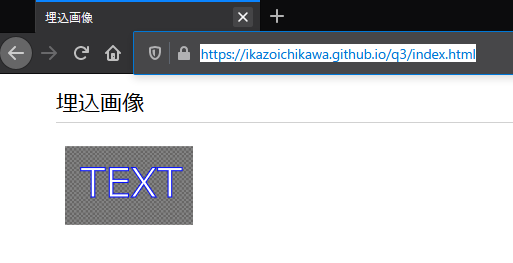

# GitHub で 埋込画像入り SVG ファイルを見ると埋込画像が表示が表示されない 

## 問題点・知りたいこと

Web ブラウザでアクセスした GitHub で、  
埋込画像入りの SVG ファイルを `画像だけを表示` させると、  
SVG ファイル内の 埋込画像部分が表示されなくなってしまい困っています。  

文章だとよくわからないと思うので画像で説明させてください。  

1. 埋込画像入りの SVG ファイルを、GitHub PJ 内にプッシュします  

具体例を以下に保存しました。  
https://github.com/ikazoichikawa/q3/blob/master/docs/assets/images/image-embedded.svg  

2. この SVG ファイルを、Web ブラウザでアクセスした GitHub で見ます  

↓ GitHub で SVG ファイルを見ると埋込画像が表示されている。  
↓ (`TEXT` の裏側に表示されている 四角い灰色の部分が、埋込画像です)

  

3. `画像だけを表示` させます

右クリックして `画像だけを表示` を選択  

  

↓ 埋込画像部分(四角い灰色の部分) が表示されない  
(`Raw` ボタンを押して画像だけを表示させても、結果は同様です)

  

なぜか埋め込んだ画像だけが表示されなくなっています、、  

いつくか試してみたことはある(以下、`試してみたこと`) のですが、原因がわかりません。  

どうしてこのようになるのか、埋込画像も表示させるにはどうしたらよいのか、  
アドバイスよろしくお願いします。  

## 試してみたこと

### PC 内のローカルディレクトリに配置した埋込画像入り SVG ファイルを Web ブラウザで開いてみる

->  
表示される。  
ブラウザ内に Load された XML を 上記の手順3 `画像だけを表示させます` の時に Load された XML と比較してみましたが、差は見受けられませんでした、、、。  

  

### html ページ内の 埋込画像入り SVG ファイルで `画像だけを表示` させてみる

->  
表示される。  
以下ページに 埋込画像入りSVG を含んだ html ページを用意してみました(note:1)が、  
ここで `画像だけを表示` させた場合は表示されます、、、。  
(埋込画像入り SVG を表示させるためだけに html ページを用意するのは現実的ではありません、、)  

https://ikazoichikawa.github.io/q3/index.html  

(note:1)  
GitHub Pages 機能を利用
(Jekyll による html 自動生成機能は オフ(= `.nojekyll` を配置)) 

↓ 埋込画像入り html ページにアクセスした状態  

  

`画像だけを表示` すると、埋込画像も表示される  

 ->   

### ブラウザ毎に表示可・不可があるのか

以下 4 種類のブラウザで試してみましたが、IE11 のみ表示されるようです。  
(しかし、イマドキのブラウザでも表示できるようにしたいのです、、、)  

| Browser                      | OK/NG |
| ---------------------------- | ----- |
| IE11                         | OK    |
| FireFox(76.0.1 (64 ビット))  | NG    |
| Google Chrome (83.0.4103.61) | NG    |
| Edge (18.18363)              | NG    |

## 環境

 - ブラウザ  
    FireFox(76.0.1 (64 ビット))  
 - SVG ファイル  
    Inkscape(0.92) で作成  
 - OS  
    Windows10(64bit)  

